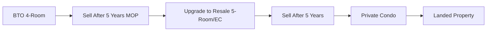

# Singapore Financial Planning Guide 🇸🇬

## Table of Contents
1. [CPF Optimization](#cpf-optimization)
2. [Housing Strategies](#housing-strategies)
3. [Tax Planning](#tax-planning)
4. [Investment Guide](#investment-guide)
5. [Insurance Planning](#insurance-planning)
6. [Retirement Planning](#retirement-planning)
7. [Family Financial Planning](#family-financial-planning)
8. [Emergency Fund](#emergency-fund)
9. [Debt Management](#debt-management)
10. [Financial Milestones by Age](#financial-milestones-by-age)

---

## CPF Optimization

### Understanding Your CPF Accounts

#### Account Types
- **Ordinary Account (OA)**: Housing, education, investments
- **Special Account (SA)**: Retirement, investment in retirement-related products
- **MediSave Account (MA)**: Healthcare expenses
- **Retirement Account (RA)**: Created at 55, for retirement payouts

### CPF Hacks & Strategies

#### 1. CPF Top-Ups for Tax Relief
- **Cash Top-Up to SA**: Up to $8,000 tax relief
- **Parents' Top-Up**: Additional $8,000 tax relief
- **Total Potential**: $16,000 tax relief annually

```
Example: $8,000 top-up at 30% tax bracket = $2,400 tax savings
Plus 4% SA interest = $320/year compound growth
```

#### 2. CPF Shielding (Before 55)
- Invest OA in property to shield from Retirement Account
- SA earns 4% vs RA at 4% (but locked till 65)

#### 3. Voluntary Housing Refund
- Refund OA used for housing to earn higher interest
- Useful when property is fully paid

#### 4. CPF Investment Scheme (CPFIS)
- Only invest if confident of beating 2.5% (OA) or 4% (SA)
- Consider STI ETF for long-term growth

### Age-Based CPF Strategies

| Age | Strategy |
|-----|----------|
| 20-30 | Focus on OA accumulation for housing |
| 30-40 | Balance between housing and SA top-ups |
| 40-50 | Maximize SA for compound interest |
| 50-55 | Consider CPF shielding strategies |
| 55+ | Optimize between BRS/FRS/ERS |

---

## Housing Strategies

### HDB vs Private Property

#### First-Time Buyers
1. **BTO**: Cheapest option, 4-year wait
2. **SBF**: Faster than BTO, limited choices
3. **Resale**: Immediate but pricier
4. **EC**: Middle ground between HDB and private

### Maximizing Grants

#### HDB Grants Checklist
- [ ] Enhanced CPF Housing Grant (up to $80k)
- [ ] Proximity Grant ($30k living with parents)
- [ ] Singles Grant (for 35+ singles)
- [ ] Step-Up Grant (for second-timers)

### Property Progression Strategy



### Decoupling Strategy
- One spouse sells share to the other
- Allows purchase of second property without ABSD
- Requires careful financial planning

---

## Tax Planning

### Income Tax Optimization

#### Key Reliefs (2024)
- **Earned Income Relief**: $1,000
- **Parent Relief**: $9,000 per parent
- **Course Fees Relief**: $5,500
- **NSman Relief**: $3,000/$1,500
- **Working Mother Relief**: 15-25% of income

### SRS (Supplementary Retirement Scheme)

#### Benefits
- Tax deferral on contributions (up to $15,300/year)
- Only 50% taxable on withdrawal after 62
- Investment gains tax-free

#### Strategy
```
Age 35: Contribute $15,300
Tax saved (at 20% bracket): $3,060
Invest for 27 years at 5% return
Age 62 value: $57,000
Tax on withdrawal (50%): Minimal due to retirement tax rates
```

### Tax-Efficient Investments
1. **Singapore Savings Bonds**: Tax-free interest
2. **STI ETF**: No capital gains tax
3. **CPF Top-ups**: Tax relief + guaranteed returns
4. **SRS investments**: Tax-deferred growth

---

## Investment Guide

### Singapore Investment Hierarchy

```
Level 5: Alternative Investments (Crypto, P2P)
Level 4: Individual Stocks (SG & International)
Level 3: Unit Trusts/Robo-Advisors
Level 2: ETFs (STI ETF, World Index)
Level 1: Fixed Income (SSB, T-bills, CPF)
Foundation: Emergency Fund (High-yield Savings)
```

### Recommended Portfolio Allocation

#### By Age
| Age | Bonds/Fixed | Equities | Alternatives |
|-----|------------|----------|--------------|
| 20-30 | 20% | 70% | 10% |
| 30-40 | 30% | 60% | 10% |
| 40-50 | 40% | 50% | 10% |
| 50-60 | 50% | 40% | 10% |
| 60+ | 60% | 30% | 10% |

### Singapore-Specific Investment Options

#### 1. Singapore Savings Bonds (SSB)
- **Pros**: Capital guaranteed, flexible redemption
- **Cons**: Capped at $200k, lower returns
- **Best for**: Emergency funds, conservative investors

#### 2. STI ETF
- **Options**: SPDR STI ETF (ES3), Nikko AM STI ETF (G3B)
- **Expense Ratio**: ~0.3%
- **Dividend Yield**: ~3-4%

#### 3. REITs
- **Singapore REITs**: Among Asia's best
- **Average Yield**: 5-7%
- **Tax**: No dividend tax for individuals

#### 4. Robo-Advisors
- **StashAway**: From 0.2% fees
- **Syfe**: Multiple portfolios
- **Endowus**: CPF investing option

---

## Insurance Planning

### Essential Coverage Hierarchy

1. **MediShield Life** (Compulsory)
2. **Integrated Shield Plan** (Recommended)
3. **Term Life Insurance** (10x annual income)
4. **Critical Illness** (5x annual income)
5. **Disability Income** (Till retirement)
6. **Whole Life** (Optional)

### Insurance Rules of Thumb

#### Life Insurance
```
Coverage Needed = (Annual Income × 10) + Outstanding Debts + Children's Education
```

#### Critical Illness
```
Coverage = Annual Income × 5 + Treatment Costs
```

### Age-Based Insurance Strategy

| Life Stage | Priority Coverage |
|------------|------------------|
| Single (20s) | Health, CI, Basic Life |
| Married (30s) | Increase Life, Add Disability |
| With Kids (30-40s) | Max Life Coverage, Education |
| Empty Nest (50s) | Reduce Life, Focus Health |
| Retirement (60+) | Minimal Life, Max Health |

---

## Retirement Planning

### CPF LIFE Decision Tree

```
If property-rich → Choose BRS (Basic Retirement Sum)
If health issues → Consider Basic Plan
If longevity in family → Consider Escalating Plan
Default → Standard Plan with FRS
```

### Retirement Income Sources

1. **CPF LIFE**: $1,500-2,500/month
2. **SRS Withdrawal**: Spread over 10 years
3. **Investment Dividends**: 4% withdrawal rate
4. **Rental Income**: If investment property
5. **Part-time Work**: Till 70

### Retirement Savings Target

| Lifestyle | Monthly Needs | Total at 65 (25 years) |
|-----------|--------------|------------------------|
| Basic | $2,000 | $600,000 |
| Comfortable | $4,000 | $1,200,000 |
| Luxurious | $6,000 | $1,800,000 |

*Assumes 3% inflation, includes CPF LIFE*

---

## Family Financial Planning

### Child Costs (Birth to University)

| Phase | Total Cost | Key Expenses |
|-------|------------|--------------|
| Baby (0-2) | $50,000 | Medical, supplies, childcare |
| Preschool (3-6) | $40,000 | Childcare, enrichment |
| Primary (7-12) | $30,000 | Tuition, activities |
| Secondary (13-16) | $25,000 | Tuition, materials |
| JC/Poly (17-18) | $15,000 | Fees, expenses |
| University (19-23) | $40,000 | Tuition, living |
| **Total** | **$200,000** | *Per child* |

### Education Funding Strategies

#### 1. Child Development Account (CDA)
- Government co-matching up to $18,000
- Use for approved expenses

#### 2. Post-Secondary Education Account (PSEA)
- Automatic transfer from CDA
- For polytechnic/university

#### 3. Education Endowment
- Start early with $200/month
- 20 years at 5% = $80,000

---

## Emergency Fund

### How Much You Need

```
Emergency Fund = Monthly Expenses × Multiplier

Multiplier:
- Single, stable job: 3-6 months
- Married, dual income: 6 months
- Single income family: 9-12 months
- Self-employed: 12 months
```

### Where to Park Emergency Funds

| Option | Interest | Liquidity | Risk |
|--------|----------|-----------|------|
| High-yield Savings | 2-3% | Immediate | None |
| Fixed Deposits | 3-4% | On maturity | None |
| Singapore Savings Bonds | 3-4% | 1 month | None |
| Money Market Funds | 3-4% | 1-2 days | Minimal |

---

## Debt Management

### Good vs Bad Debt

#### Good Debt
- **HDB Loan**: 2.6% interest, appreciating asset
- **Education Loan**: Investment in earning power
- **Business Loan**: For income generation

#### Bad Debt
- **Credit Card**: 25% interest
- **Personal Loan**: 5-8% interest
- **Car Loan**: Depreciating asset

### Debt Repayment Strategy

1. **List all debts** by interest rate
2. **Pay minimums** on all debts
3. **Attack highest rate** first (Avalanche method)
4. Alternative: **Smallest balance** first (Snowball method)

### Debt-to-Income Guidelines

```
Total Debt Service Ratio (TDSR) = 55% max
Mortgage Service Ratio (MSR) = 30% max (HDB)

Healthy ratios:
- Housing: <30% of income
- Total debt: <40% of income
- Savings: >20% of income
```

---

## Financial Milestones by Age

### 20s: Foundation Building
- [ ] Start CPF contributions
- [ ] Build 6-month emergency fund
- [ ] Get basic insurance coverage
- [ ] Start investing (even $100/month)
- [ ] Avoid credit card debt

### 30s: Accumulation Phase
- [ ] Buy first property (BTO/Resale)
- [ ] 1x annual income saved
- [ ] Max out CPF SA top-ups
- [ ] Start SRS contributions
- [ ] Review insurance needs (especially with kids)

### 40s: Growth Phase
- [ ] 3-5x annual income saved
- [ ] Consider property upgrade
- [ ] Maximize tax reliefs
- [ ] Review investment risk (reduce if needed)
- [ ] Plan children's education funding

### 50s: Pre-Retirement
- [ ] 8-10x annual income saved
- [ ] Clear all bad debts
- [ ] Consider CPF shielding
- [ ] Review retirement plans
- [ ] Estate planning basics

### 60s: Retirement Transition
- [ ] Decide on CPF LIFE plan
- [ ] Optimize SRS withdrawals
- [ ] Downsize property if needed
- [ ] Finalize estate planning
- [ ] Healthcare coverage review

---

## Quick Financial Health Check

Rate yourself (1 point each):
- [ ] Emergency fund ≥ 6 months expenses
- [ ] Saving ≥ 20% of income
- [ ] No high-interest debt
- [ ] Adequate insurance coverage
- [ ] Regular investment plan
- [ ] CPF on track for retirement
- [ ] Property within 5x annual income
- [ ] Tax reliefs optimized
- [ ] Will/LPA in place
- [ ] Clear retirement plan

**Score Interpretation:**
- 8-10: Excellent financial health
- 6-7: Good, some areas to improve
- 4-5: Fair, need attention
- <4: Urgent review needed

---

## Resources & Tools

### Government Resources
- **MoneySense**: moneysense.gov.sg
- **CPF Board**: cpf.gov.sg/calculator
- **HDB**: hdb.gov.sg/financial-tools
- **IRAS**: iras.gov.sg/tax-calculator

### Financial Comparison Sites
- **MoneySmart**: moneysmart.sg
- **SingSaver**: singsaver.com.sg
- **Seedly**: seedly.sg
- **GoBear**: gobear.com/sg

### Investment Platforms
- **CDP**: sgx.com
- **Tiger Brokers**: Low fees
- **Interactive Brokers**: Professional
- **Saxo**: Comprehensive

### Educational Content
- **The Woke Salaryman**: Visual guides
- **Investment Moats**: Deep analysis
- **Dr Wealth**: Practical investing
- **Seedly Blog**: Community wisdom

---

## Common Financial Mistakes to Avoid

1. **Over-leveraging on property**
   - Don't max out TDSR
   - Keep buffer for interest rate rises

2. **Ignoring inflation**
   - 2-3% annually erodes savings
   - Invest to beat inflation

3. **Inadequate insurance**
   - Underinsured more common than overinsured
   - Review coverage annually

4. **Emotional investing**
   - Don't time the market
   - Dollar-cost averaging wins

5. **Not maximizing CPF**
   - It's risk-free 2.5-4% returns
   - Compound interest is powerful

6. **Lifestyle inflation**
   - Save raise increments
   - Maintain lifestyle despite income growth

7. **No estate planning**
   - Intestacy laws may not reflect wishes
   - LPA important for incapacity

---

*Last Updated: October 2024*
*Disclaimer: This guide is for educational purposes. Consult qualified financial advisors for personal advice.*